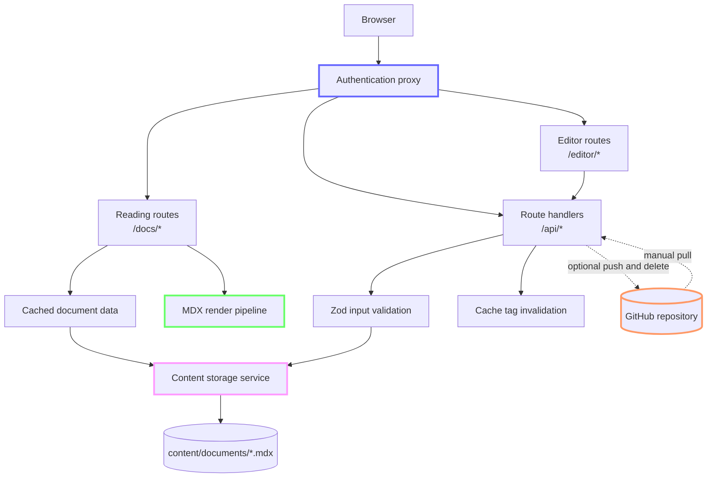

# Audit CMS

Audit CMS is a self-contained content management system for writing, organizing, reviewing, and publishing technical audit documents. It stores each document as an MDX file, renders published content through a Next.js application, and can mirror every change to a GitHub repository for history and backup.

The application is designed around a small, inspectable content model. There is no database or external CMS. The files in `content/documents/` are the runtime source of truth.

## What the project provides

- An authenticated reading surface for published documents at `/docs`
- A document dashboard at `/editor`
- Creation, metadata editing, Markdown editing, preview, and deletion workflows
- Two-second debounced autosave in the document editor
- Nested document slugs such as `platform/builds/optimization`
- Draft, published, and archived document states
- YAML frontmatter validation with Zod
- Server-rendered MDX with GitHub Flavored Markdown and Shiki syntax highlighting
- Optional GitHub push, delete, and pull synchronization
- Cache Components with tag-based invalidation after content mutations
- Light and dark themes built with Tailwind CSS and shadcn/Base UI components

## How the system is organized

Audit CMS separates the browser interface, route handlers, content services, and file storage. Read requests go through the MDX rendering pipeline. Write requests go through validated API routes before reaching the filesystem and optional GitHub mirror.



### The application layer

The project uses the Next.js 16 App Router and React 19. Server Components load and render documents, while Client Components handle forms, editor state, autosave, theme selection, and synchronization controls.

The main route groups are:

| Route | Responsibility |
| --- | --- |
| `/` | Redirects to `/docs` |
| `/login` | Accepts the shared application password |
| `/docs` | Lists documents whose status is `published` |
| `/docs/[...slug]` | Renders one MDX document |
| `/editor` | Lists every document and reports GitHub configuration status |
| `/editor/new` | Creates a document |
| `/editor/[...slug]` | Edits content and metadata, previews, or deletes a document |
| `/api/*` | Validates mutations, accesses storage, manages sync, and invalidates caches |

### The content layer

`src/lib/content/` implements the content domain:

- `schema.ts` defines document types, input schemas, and slug generation.
- `parser.ts` converts between YAML-frontmatter files and typed documents.
- `storage.ts` reads and mutates the local filesystem and constructs document trees.
- `render.tsx` sends document bodies through the server-side MDX renderer.

The storage layer recursively scans `content/documents/` for `.md` and `.mdx` files. A file's relative path determines its effective slug. For example, `content/documents/platform/builds.mdx` is available as `platform/builds`, even if the frontmatter contains a different `slug` value.

### The rendering layer

`src/lib/mdx/` and `src/components/mdx/` configure the rendered document experience:

- `remark-gfm` adds tables, task lists, strikethrough, and other GitHub Flavored Markdown features.
- Shiki highlights fenced code blocks with separate light and dark themes.
- Heading components create stable anchor links from heading text.
- Relative document links route through `/docs`.
- External links open in a new tab.
- Images use `next/image`; external images render without Next.js optimization.
- `<Callout>` supports `info`, `warning`, `error`, and `success` variants.
- Mermaid code fences are transformed into a custom component, but the reading-view Mermaid renderer is currently disabled and returns no visible output.

### The GitHub integration layer

`src/lib/github/client.ts` wraps Octokit, while `src/lib/github/sync.ts` translates document operations into repository content operations.

GitHub is an optional mirror rather than the primary content store:

- Creating or updating a document writes the local file first, then creates a GitHub commit with an `Update: <title>` message.
- Deleting a document moves the local file to `content/.trash/`, then deletes the mirrored GitHub file with a `Delete: <title>` commit.
- Pulling from GitHub recursively downloads `.md` and `.mdx` files and overwrites matching local files.
- Pull does not remove local files that are absent from GitHub.
- Sync failures do not roll back successful local changes. Mutation responses include the sync result so callers can detect divergence.

The process keeps GitHub file SHAs in an in-memory map to support later updates. It also fetches the current remote SHA before each push or delete, so a process restart does not permanently lose update capability.

## Core concepts

### Files are the source of truth

Each document is a portable text file containing YAML frontmatter and an MDX body. The application does not keep document state in a database. You can inspect, diff, copy, and version the full content library with ordinary file and Git tools.

Only `content/documents/` is loaded at runtime. The top-level `documents/` directory contains separate working copies and is not read by the application.

### Slugs are both URLs and file paths

A slug maps directly to a path beneath `content/documents/`:

```text
architecture                         -> content/documents/architecture.mdx
platform/build-optimization          -> content/documents/platform/build-optimization.mdx
```

Slugs may contain lowercase letters, numbers, hyphens, and forward slashes. Creating a nested slug creates its parent directories. The editor does not rename slugs after creation because the update schema does not accept a new slug.

### Metadata controls organization and visibility

Every document uses the following metadata:

| Field | Type | Required | Default | Purpose |
| --- | --- | --- | --- | --- |
| `id` | UUID string | Yes | Generated on creation | Stable document identity |
| `title` | String, 1 to 200 characters | Yes | None | Display title |
| `slug` | String | Yes | Generated from the title | URL and storage identity; the file path overrides it during reads |
| `description` | String | No | None | Summary shown in document listings and headers |
| `createdAt` | ISO 8601 datetime | Yes | Current time on creation | Creation timestamp |
| `updatedAt` | ISO 8601 datetime | Yes | Current time on mutation | Last mutation timestamp |
| `status` | `draft`, `published`, or `archived` | Yes | `draft` | Listing visibility and editorial state |
| `tags` | String array | Yes | `[]` | Labels shown in the interface |
| `parent` | Slug string | No | None | Explicit parent used by the tree API |
| `order` | Number | Yes | `0` | Sort order in lists and trees |

The `/docs` index includes only `published` documents. A direct `/docs/<slug>` request does not enforce status, so authenticated users who know a draft or archived slug can open it. All application pages remain behind the shared authentication proxy.

### Parent relationships are explicit

Nested file paths and document hierarchy are related but separate concepts. A nested slug controls storage and routing. The `parent` field controls the tree returned by `/api/documents/tree`.

If a document names a missing parent, the tree service places it at the root. Siblings and root nodes are sorted by `order`.

### Mutations are local-first

Document writes use a temporary file followed by a rename, which prevents readers from observing a partially written file. The create and update flows then attempt GitHub synchronization and invalidate relevant Next.js cache tags.

Deleting a document is recoverable on the local filesystem because the file moves to `content/.trash/` with a timestamped name. A restore function exists in the storage module, but there is no restore API or interface yet. GitHub deletion is permanent from the current branch, subject to Git history.

### Cache tags connect reads and writes

The application enables Next.js Cache Components in `next.config.ts` and uses a cache life of `days` for document reads and rendered MDX.

Two tag patterns coordinate cache invalidation:

- `documents-list` covers document listings and the document tree.
- `doc-<slug>` covers a specific document.

Create operations invalidate `documents-list`. Update and delete operations invalidate both tags. A GitHub pull currently invalidates `documents-list` only, so an already cached document detail may remain stale until its cache expires or the application restarts.

### Authentication is a shared access gate

`src/proxy.ts` protects every application and API route except `/login` and `/api/auth`. A successful login sets an HTTP-only cookie for seven days. Production cookies also use the `secure` flag and all auth cookies use `SameSite=Lax`.

This authentication model provides a shared password for a trusted, private deployment. It does not provide user accounts, roles, signed sessions, audit attribution, brute-force protection, or per-document authorization. The proxy checks for the cookie's presence rather than verifying a signed value. Replace this layer before exposing the application to untrusted users or sensitive content.

## Document format

A valid document contains complete frontmatter followed by Markdown or MDX:

````mdx
---
id: 4cb4247a-28f4-47d2-a88b-03cb5a3cd011
title: Build optimization analysis
slug: build-optimization-analysis
description: Findings and recommendations from the build audit
createdAt: '2026-07-31T14:00:00.000Z'
updatedAt: '2026-07-31T14:00:00.000Z'
status: draft
tags:
  - build
  - performance
order: 10
---

## Summary

The audit found three opportunities to reduce build time.

<Callout type="warning">
Validate the deployment output before changing production build settings.
</Callout>

```ts
export const target = 'production'
```
````

The API creates IDs and timestamps automatically. When adding a file by hand, provide every required field in the table above. Files with invalid frontmatter are logged and omitted from listings.

## Run the project locally

### Prerequisites

- [Bun](https://bun.sh/) 1.x
- A GitHub repository and token only if you want remote synchronization

The project currently uses Bun 1.3.5 and Node.js 22 in development. `package.json` does not enforce exact runtime versions.

### Install and start the application

1. Install dependencies:

   ```bash
   bun install
   ```

2. Create `.env.local` with at least a non-default password:

   ```dotenv
   AUTH_PASSWORD=replace_with_a_long_random_password
   AUTH_COOKIE_NAME=audit-cms-auth
   ```

3. Start the development server:

   ```bash
   bun run dev
   ```

   Next.js reports the local URL, normally `http://localhost:3000`.

4. Open [http://localhost:3000](http://localhost:3000), sign in, and use `/docs` or `/editor`.

The code falls back to `changeme` when `AUTH_PASSWORD` is absent. Set `AUTH_PASSWORD` in every environment rather than relying on that development fallback.

## Configure GitHub synchronization

Add the following variables to `.env.local` to enable synchronization:

```dotenv
GITHUB_TOKEN=your_github_token_here
GITHUB_OWNER=your_organization_or_username_here
GITHUB_REPO=your_repository_name_here
GITHUB_BRANCH=main
GITHUB_CONTENT_PATH=content/documents
```

The token must be able to read and write repository contents. All three of `GITHUB_TOKEN`, `GITHUB_OWNER`, and `GITHUB_REPO` must be present before the integration reports itself as configured.

| Variable | Required | Default | Purpose |
| --- | --- | --- | --- |
| `AUTH_PASSWORD` | Yes | `changeme` | Shared login password |
| `AUTH_COOKIE_NAME` | No | `audit-cms-auth` | Authentication cookie name used by the login route and proxy |
| `GITHUB_TOKEN` | For GitHub sync | None | Authenticates Octokit |
| `GITHUB_OWNER` | For GitHub sync | None | Repository owner or organization |
| `GITHUB_REPO` | For GitHub sync | None | Repository name |
| `GITHUB_BRANCH` | No | `main` | Branch read and written by the integration |
| `GITHUB_CONTENT_PATH` | No | `content/documents` | Repository directory containing document files |

When GitHub is not configured, create, update, and delete operations continue locally. Their sync result reports that synchronization was skipped.

## Work with documents

### Create and edit through the interface

1. Open `/editor` and select **New Document**.
2. Enter a title, slug, optional description, status, and initial content.
3. Open the new document's editor to update its body, title, description, status, or tags.
4. Wait for autosave or select **Save**. Autosave runs two seconds after the latest change.
5. Select **Preview** to open the reading route in a new tab.

The new-document form supports `draft` and `published`. The metadata editor also supports `archived`.

### Edit files directly

You can edit `.md` or `.mdx` files under `content/documents/` with any text editor. Direct file edits bypass API validation, GitHub synchronization, timestamp updates, and cache invalidation. Restart the development server if a cached page does not reflect a direct edit.

### Pull remote documents

When GitHub is configured, select **Pull from GitHub** on `/editor`. The pull walks `GITHUB_CONTENT_PATH` recursively and downloads every `.md` and `.mdx` file.

Pull is an overwrite operation without conflict detection. Commit or copy local changes before pulling if the remote repository may contain different content.

## API reference

All API routes except `/api/auth` pass through the authentication proxy.

| Method | Route | Behavior |
| --- | --- | --- |
| `POST` | `/api/auth` | Validates the shared password and sets the auth cookie |
| `DELETE` | `/api/auth` | Deletes the auth cookie |
| `GET` | `/api/documents` | Lists metadata and a 200-character content preview; accepts an optional `parent` query parameter |
| `POST` | `/api/documents` | Validates and creates a document, then attempts a GitHub push |
| `GET` | `/api/documents/[...slug]` | Returns one complete document |
| `PUT` | `/api/documents/[...slug]` | Validates a partial update, writes it, pushes it, and invalidates caches |
| `DELETE` | `/api/documents/[...slug]` | Moves the local file to trash and deletes the GitHub mirror |
| `GET` | `/api/documents/tree` | Returns documents grouped by explicit `parent` relationships |
| `GET` | `/api/sync` | Returns the configured GitHub owner, repository, and branch |
| `POST` | `/api/sync` | Pulls all remote document files into local storage |
| `GET` | `/api/sync/status` | Tests the GitHub connection and returns repository details |

Create requests accept the following shape:

```json
{
  "title": "Build optimization analysis",
  "slug": "build-optimization-analysis",
  "content": "## Summary\n\nAudit findings go here.",
  "description": "Findings and recommendations from the build audit",
  "status": "draft",
  "tags": ["build", "performance"],
  "order": 10
}
```

Update requests accept any subset of `title`, `content`, `description`, `status`, `tags`, `parent`, and `order`. Slug changes are not supported by the update endpoint.

## Project structure

```text
audit-cms/
├── content/
│   ├── documents/              Runtime MDX content
│   └── .trash/                 Soft-deleted local documents, created on demand
├── documents/                  Non-runtime working copies
├── public/                     Static assets
├── src/
│   ├── app/
│   │   ├── api/                Auth, document, tree, and sync route handlers
│   │   ├── docs/               Document index and reading routes
│   │   ├── editor/             Document management routes
│   │   ├── login/              Shared-password login
│   │   └── layout.tsx          Root metadata, fonts, and theme provider
│   ├── components/
│   │   ├── editor/             In-progress rich MDX editor components
│   │   ├── mdx/                Rendered MDX components
│   │   └── ui/                 shadcn/Base UI primitives
│   ├── lib/
│   │   ├── content/            Schema, parser, filesystem storage, and rendering
│   │   ├── data/               Cached document data access
│   │   ├── editor/             Rich-editor configuration
│   │   ├── github/             Octokit client and synchronization
│   │   └── mdx/                Remark and rehype configuration
│   └── proxy.ts                Shared authentication boundary
├── biome.json                  Formatting and linting configuration
├── next.config.ts              Next.js Cache Components configuration
└── package.json                Scripts and dependencies
```

The rich MDX editor under `src/components/editor/` is not connected to the current reading or settings routes. The active `/editor/[...slug]` route uses a Markdown textarea.

## Development commands

| Command | Purpose |
| --- | --- |
| `bun run dev` | Start the Next.js development server with the Bun runtime |
| `bun run build` | Create a production build |
| `bun run start` | Serve the production build |
| `bun run lint` | Check supported source files with Biome |
| `bun run lint:fix` | Apply Biome's safe lint and formatting fixes |
| `bun run format` | Format supported files with Biome |

There is no automated test suite or `test` script in the repository. Use the production build and Biome checks as the current baseline, then verify document create, edit, publish, delete, and sync paths manually when changing those systems.

## Deployment and persistence model

Audit CMS requires a writable, persistent working directory for document mutations. The application writes beneath `content/` at runtime and treats those files as canonical.

This constraint matters on serverless or ephemeral hosting:

- A read-only deployment can render files included in the build, but create, update, delete, and pull operations require filesystem writes.
- An ephemeral filesystem can accept a write and then lose it when the instance restarts or another instance serves the next request.
- GitHub synchronization occurs after the local write, so it does not turn the current storage adapter into a GitHub-first or stateless backend.
- Multiple application instances can diverge because they do not share files or the in-memory SHA cache.

For the current implementation, run the application on a single process with persistent storage. To deploy on stateless infrastructure, replace `src/lib/content/storage.ts` with a durable storage adapter and decide whether GitHub or that store owns conflict resolution.

## Current limitations

- Authentication is a shared, unsigned cookie gate intended for trusted environments.
- Document slugs cannot be renamed through the API or editor.
- Draft and archived documents remain reachable by direct URL after authentication.
- GitHub pull overwrites matching files and has no merge or conflict workflow.
- GitHub pull invalidates list caches but not each document-detail cache.
- Local trash has no restore interface or API.
- Mermaid rendering in the reading view is disabled.
- The rich MDX editor is present as in-progress code but is not mounted by the active routes.
- The repository has no automated tests.

## Code conventions

- TypeScript uses strict mode and the `@/*` alias for `src/*`.
- Biome formats with two spaces, single quotes, and omitted semicolons.
- Tailwind CSS 4 provides styling through `src/app/globals.css`.
- UI components expose `data-slot` attributes and use `cn()` for class composition.
- Server-side inputs are validated with Zod before document mutations.
- Document write helpers belong in `src/lib/content/`; GitHub-specific behavior belongs in `src/lib/github/`.

When changing the content model, update the Zod schemas, serialization behavior, editor forms, API payloads, and this README together.
