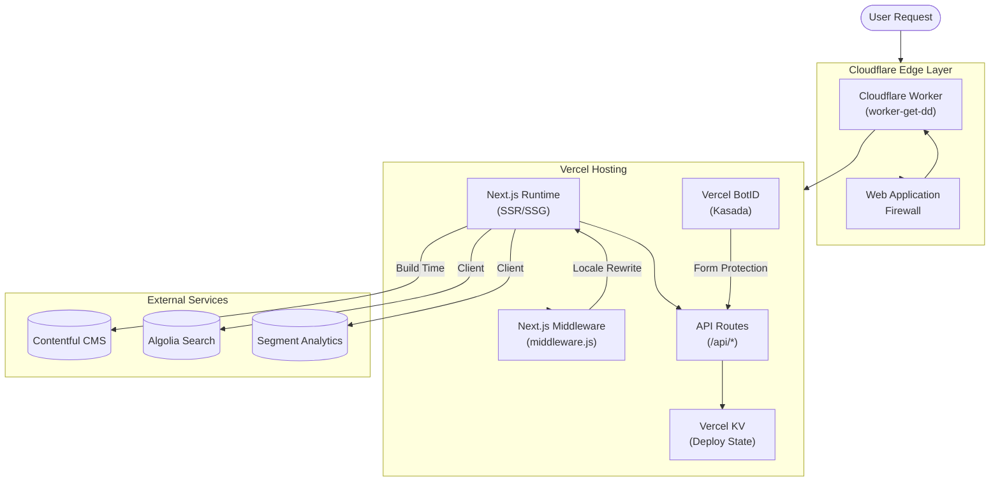
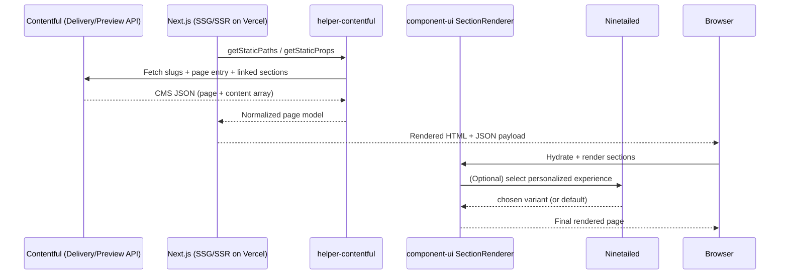
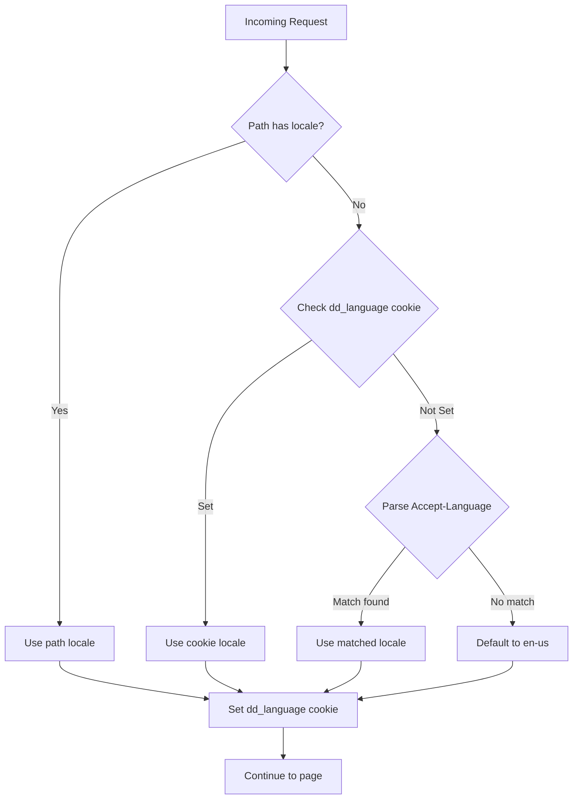
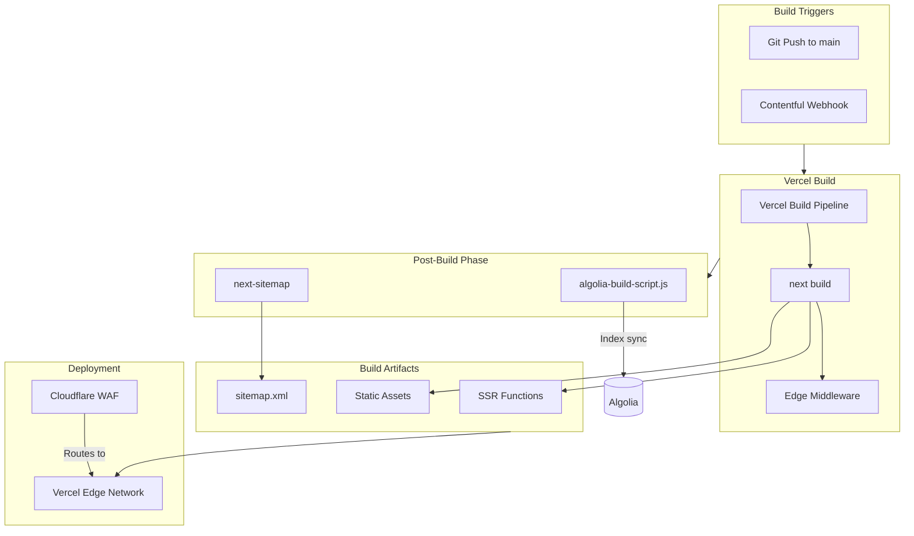
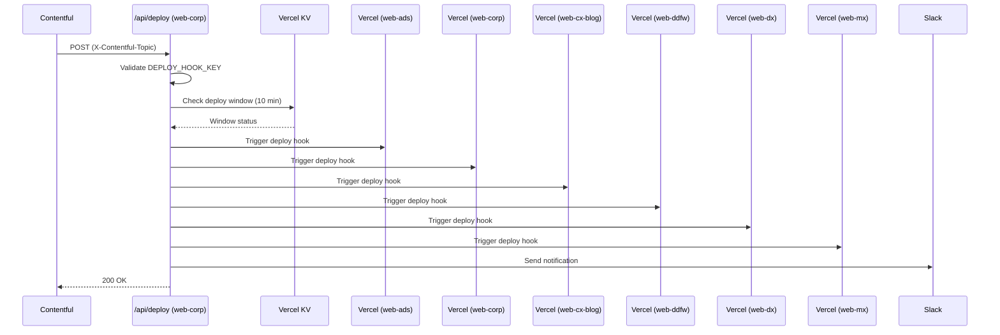
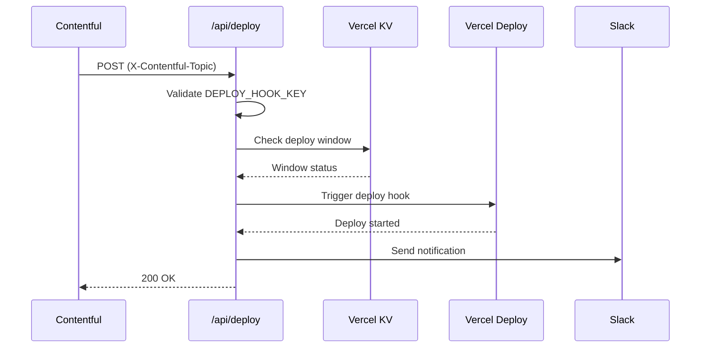
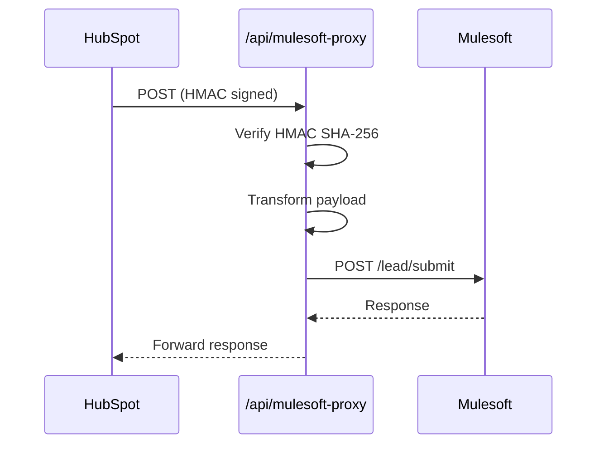

## Table of Contents!

1. [Executive Summary](#1-executive-summary)
2. [High-Level Architecture](#2-high-level-architecture)
3. [Technology Stack](#3-technology-stack)
4. [Monorepo Structure](#4-monorepo-structure)
5. [Shared Internal Packages](#5-shared-internal-packages)
6. [Web Application Overview](#6-web-application-overview)
7. [Hosting Infrastructure](#7-hosting-infrastructure)
8. [Content Management (Contentful)](#8-content-management-contentful)
9. [Routing Architecture](#9-routing-architecture)
10. [Internationalization (i18n)](#10-internationalization-i18n)
11. [Analytics & Personalization](#11-analytics--personalization)
12. [API Routes & Integrations](#12-api-routes--integrations)
13. [Build Pipeline & Automation](#13-build-pipeline--automation)
14. [Development Workflow](#14-development-workflow)
15. [Application-Specific Deep Dives](#15-application-specific-deep-dives)
16. [Key Architectural Patterns](#16-key-architectural-patterns)
17. [Security & Compliance](#17-security--compliance)
18. [Testing Infrastructure](#18-testing-infrastructure)
19. [Operational Gotchas & Known Issues](#19-operational-gotchas--known-issues)
20. [Quick Reference](#20-quick-reference)

---

## 1. Executive Summary

The DoorDash marketing web ecosystem is a **pnpm workspace monorepo** containing **6 production web applications** that serve DoorDash's key stakeholder audiences. The architecture follows a **"Thin Client"** pattern where each web property acts primarily as a configuration layer, with **~95% of application logic, UI components, and business rules** residing in shared internal packages.

### The Mental Model

This repo is best understood as a **configuration-driven monorepo**:

- **Thin clients (6 apps)**: Each `packages/web-*` project is a mostly-standard Next.js Pages Router app that:
    - Defines **routing entry points** and site-specific URL structure
    - Defines **environment config** (Contentful website IDs, tokens, feature flags)
    - Runs **build-time automation** (redirect generation, sitemap generation, Algolia indexing)
    - Provides **site-specific UI composition** (headers/footers, theming, a handful of special cases)
- **Shared core (internal packages)**: The majority of UI + data plumbing lives in shared packages

### Key Metrics

| Metric | Value |
| --- | --- |
| Total Web Applications | 6 |
| Shared Packages | 7 |
| Component UI Files | ~355 |
| Framework | Next.js 14.1.0 (Pages Router) |
| Hosting Platform | Vercel |
| Edge Security | Cloudflare WAF/Workers |
| CMS | Contentful (Headless) |
| Package Manager | pnpm |

### Web Properties at a Glance

| Application | Domain | Audience | Primary Purpose |
| --- | --- | --- | --- |
| `web-ads` | [advertising.doordash.com](http://advertising.doordash.com/) | Advertisers, Brands | Advertising platform marketing |
| `web-corp` | [about.doordash.com](http://about.doordash.com/) | Investors, Press, Public | Corporate information & newsroom |
| `web-cx-blog` | [blog.doordash.com](http://blog.doordash.com/) | Consumers | Consumer-facing blog ("Block Party") |
| `web-ddfw` | [business.doordash.com](http://business.doordash.com/) | B2B Clients | DoorDash for Work (corporate accounts) |
| `web-dx` | [dasher.doordash.com](http://dasher.doordash.com/) | Delivery Partners | Dasher recruitment & resources |
| `web-mx` | [merchants.doordash.com](http://merchants.doordash.com/) | Restaurant Partners | Merchant onboarding & resources |

---

## 2. High-Level Architecture

### The "Thin Client" Model

```
┌─────────────────────────────────────────────────────────────────────────┐
│                        THIN CLIENT APPLICATIONS                         │
│  ┌─────────┐ ┌─────────┐ ┌──────────┐ ┌─────────┐ ┌────────┐ ┌────────┐ │
│  │ web-ads │ │web-corp │ │web-cx-   │ │web-ddfw │ │ web-dx │ │ web-mx │ │
│  │         │ │         │ │blog      │ │         │ │        │ │        │ │
│  └────┬────┘ └───┬─────┘ └────┬─────┘ └────┬────┘ └───┬────┘ └──┬─────┘ │
│       │          │            │            │          │         │       │
│       └──────────┴────────────┴───────┬────┴──────────┴─────────┘       │
│                                       │                                 │
│                      ┌────────────────▼────────────────┐                │
│                      │     SHARED PACKAGES LAYER       │                │
│                      │                                 │                │
│                      │  ┌─────────────────────────┐    │                │
│                      │  │   component-ui (355+)   │    │                │
│                      │  │   Section renderers,    │    │                │
│                      │  │   forms, providers      │    │                │
│                      │  └─────────────────────────┘    │                │
│                      │  ┌─────────────────────────┐    │                │
│                      │  │         dls             │    │                │
│                      │  │   Themes, analytics,    │    │                │
│                      │  │   i18n, helpers         │    │                │
│                      │  └─────────────────────────┘    │                │
│                      │  ┌─────────────────────────┐    │                │
│                      │  │   helper-contentful     │    │                │
│                      │  │   CMS client, types,    │    │                │
│                      │  │   Ninetailed            │    │                │
│                      │  └─────────────────────────┘    │                │
│                      │  ┌──────┐ ┌──────┐ ┌───────┐    │                │
│                      │  │ geo  │ │forms │ │routing│    │                │
│                      │  └──────┘ └──────┘ └───────┘    │                │
│                      └─────────────────────────────────┘                │
└─────────────────────────────────────────────────────────────────────────┘
                                   │
                                   ▼
┌─────────────────────────────────────────────────────────────────────────┐
│                       EXTERNAL SERVICES                                 │
│  ┌────────────┐  ┌─────────────┐  ┌─────────────┐  ┌─────────────────┐  │
│  │ Contentful │  │   Algolia   │  │   Segment   │  │   Ninetailed    │  │
│  │    CMS     │  │   Search    │  │  Analytics  │  │ Personalization │  │
│  └────────────┘  └─────────────┘  └─────────────┘  └─────────────────┘  │
└─────────────────────────────────────────────────────────────────────────┘
                                   │
                                   ▼
┌─────────────────────────────────────────────────────────────────────────┐
│                       HOSTING INFRASTRUCTURE                            │
│                                                                         │
│  ┌─────────────────────────────────────────────────────────────────┐    │
│  │                    CLOUDFLARE EDGE LAYER                        │    │
│  │  ┌─────────────┐  ┌─────────────┐  ┌─────────────────────────┐  │    │
│  │  │   Workers   │  │     WAF     │  │     Stream (Video)      │  │    │
│  │  │(Edge Logic) │  │ (Security)  │  │       (CDN)             │  │    │
│  │  └─────────────┘  └─────────────┘  └─────────────────────────┘  │    │
│  └─────────────────────────────────────────────────────────────────┘    │
│                                   │                                     │
│                                   ▼                                     │
│  ┌─────────────────────────────────────────────────────────────────┐    │
│  │                    VERCEL HOSTING LAYER                         │    │
│  │  ┌─────────────┐  ┌─────────────┐  ┌─────────────────────────┐  │    │
│  │  │  Next.js    │  │  Vercel KV  │  │    Vercel BotID         │  │    │
│  │  │  Runtime    │  │  (Storage)  │  │  (Bot Protection)       │  │    │
│  │  └─────────────┘  └─────────────┘  └─────────────────────────┘  │    │
│  └─────────────────────────────────────────────────────────────────┘    │
└─────────────────────────────────────────────────────────────────────────┘

```

### Request Flow Architecture



### Content Rendering Pipeline



**Notes:**

- **Cloudflare Workers** handle edge-level routing and security before requests reach Vercel
- **Vercel** provides the primary hosting with full Next.js runtime support (SSR, ISR, API routes)
- The upstream Worker (`worker-get-dd`) is managed outside this repo (in `doordash/tf_cdn_cloudflare_workers` + `doordash/tf_cdn_cloudflare`)
- Unlike static export mode, the full Next.js feature set is available (middleware, API routes, ISR)

---

## 3. Technology Stack

### Core Framework & Runtime

| Technology | Version | Purpose |
| --- | --- | --- |
| **Next.js** | 14.1.0 | React framework (Pages Router) |
| **React** | 18.2.0 | UI library |
| **React DOM** | 18.2.0 | React DOM bindings |
| **TypeScript** | 5.2.2 | Type-safe JavaScript |
| **Node.js** | 18+ | Runtime environment |

### Styling & Design

| Technology | Version | Purpose |
| --- | --- | --- |
| **styled-components** | 5.3.11 | CSS-in-JS (with SSR compiler) |
| **Sass** | 1.77.8 | SCSS global styles |
| **@doordash/prism-react** | ^9.22.0 | DoorDash design system |

### Content & Search

| Technology | Version | Purpose |
| --- | --- | --- |
| **Contentful** | 10.10.0 | Headless CMS client |
| **@contentful/rich-text-*** | Various | Rich text rendering |
| **@contentful/live-preview** | Latest | Editorial preview |
| **Algolia** | 4.24.0 | Search indexing & client |
| **search-insights** | 2.15.0 | Algolia analytics |

### Analytics & Personalization

| Technology | Version | Purpose |
| --- | --- | --- |
| **@segment/analytics-next** | 1.72.1 | Event tracking |
| **@ninetailed/experience.js-next** | ^7.9.0 | A/B testing & personalization |
| **Rosetta** | 1.1.0 | Lightweight i18n |

### Hosting & Infrastructure

| Technology | Version | Purpose |
| --- | --- | --- |
| **Vercel** | - | Primary hosting platform |
| **Vercel KV** | - | Redis-based key-value storage |
| **Vercel BotID** | - | Bot protection (Kasada) |
| **Cloudflare Workers** | - | Edge security/WAF layer |
| **@cloudflare/stream-react** | 1.9.1 | Video streaming CDN |
| **@marsidev/react-turnstile** | ^1.0.2 | CAPTCHA (backup) |

### Build & Development

| Technology | Version | Purpose |
| --- | --- | --- |
| **pnpm** | Latest | Package manager |
| **Jest** | 29.7.0 | Test runner |
| **@testing-library/react** | 14.2.1 | Component testing |
| **@next/bundle-analyzer** | Latest | Bundle analysis |
| **next-sitemap** | 4.2.3 | Sitemap generation |

---

## 4. Monorepo Structure

### Directory Layout

```
/
├── packages/
│   ├── web-ads/                    # Advertising marketing site
│   ├── web-corp/                   # Corporate site
│   ├── web-cx-blog/                # Consumer blog
│   ├── web-ddfw/                   # DoorDash for Work
│   ├── web-dx/                     # Dasher recruitment
│   ├── web-mx/                     # Merchant portal
│   │
│   ├── component-ui/               # Shared UI components (~355 files)
│   ├── component-addressautocomplete/ # Google Maps autocomplete
│   ├── dls/                        # Design Language System
│   ├── helper-contentful/          # Contentful utilities
│   ├── helper-forms/               # Form utilities
│   ├── helper-geo/                 # Geolocation helpers
│   ├── helper-routing/             # Middleware & routing
│   └── migrations/                 # Contentful migrations
│
├── functions_rem/                  # Legacy Cloudflare Pages Functions (unused)
│   └── api/v1/geo.ts              # Legacy geolocation endpoint
│
├── pnpm-workspace.yaml            # Workspace configuration
├── pnpm-lock.yaml                 # Lock file
├── package.json                   # Root package.json
├── tsconfig.json                  # Base TypeScript config
├── jest.config.js                 # Root Jest config
│
├── shared-algolia-helpers.js      # Algolia indexing utilities
├── shared-contentful-helpers.js   # Contentful utilities
├── cloudflare-kv-helpers.js       # Legacy KV store utilities (unused)
└── next-common-rewrites.js        # Development rewrites

```

### Root Scripts Pattern

The root `package.json` provides convenient wrappers:

- `pnpm run web-mx-dev` → `pnpm -F 'web-mx' run dev`
- `pnpm run web-mx-export` → `pnpm -F 'web-mx' run export`

---

## 5. Shared Internal Packages

### Package Dependency Graph

```
                    ┌────────────────────────────────────────┐
                    │          WEB APPLICATIONS              │
                    │ web-ads, web-corp, web-cx-blog,        │
                    │ web-ddfw, web-dx, web-mx               │
                    └──────────────────┬─────────────────────┘
                                       │
           ┌───────────────────────────┼─────────────────────────┐
           │                           │                         │
           ▼                           ▼                         ▼
┌─────────────────────┐    ┌─────────────────────┐    ┌─────────────────────┐
│   component-ui      │    │        dls          │    │  helper-contentful  │
│   "The Mover"       │    │    "The Styler"     │    │   "The Fetcher"     │
│                     │◄───│                     │◄───│                     │
│ • Section Renderers │    │ • Theme Engine      │    │ • Data Fetching     │
│ • Complex Forms     │    │ • Analytics         │    │ • Ninetailed        │
│ • Global Providers  │    │ • I18n (Rosetta)    │    │ • Type Definitions  │
│ • Storybook         │    │ • Helpers           │    │ • Preview Support   │
└─────────────────────┘    └─────────────────────┘    └─────────────────────┘
           │                           │                         │
           └───────────────────────────┼─────────────────────────┘
                                       │
           ┌───────────────────────────┼─────────────────────────┐
           │                           │                         │
           ▼                           ▼                         ▼
┌─────────────────────┐    ┌─────────────────────┐    ┌─────────────────────┐
│    helper-geo       │    │   helper-forms      │    │   helper-routing    │
│   "The Locator"     │    │   "The Validator"   │    │  "The Navigator"    │
│                     │    │                     │    │                     │
│• GeoLocationProvider│    │ • Form utilities    │    │ • Locale detection  │
│• GDPR/CCPA logic    │    │ • Validation        │    │ • Redirect handling │
└─────────────────────┘    └─────────────────────┘    └─────────────────────┘

```

### Package Details

### 1. `@doordash-marketing/component-ui` — The Mover

The heart of the frontend architecture with **~355 files**.

**Contents:**

- **Section Renderers**: Maps Contentful content types to React components
- **Complex Forms**: Lead Gen, Dasher Signups, Merchant Onboarding
- **Global Providers**: `ModalContext`, `WebsiteProvider`, `PageUnavailableContext`
- **Blog Components**: Post layouts, category pages, author pages
- **Search UI**: Algolia-powered search sidesheets

**Supported Section Types:**

| Content Type | Component | Description |
| --- | --- | --- |
| `uiHero` | `MainHero` | Page hero sections |
| `uiMulticolumnSection` | `MulticolumnSection` | Grid layouts |
| `uiTwoColumnFeatureSection` | `TwoColumnFeatureSection` | Feature blocks |
| `uiFaqSection` | `FAQSection` | FAQ accordions |
| `uiImageGallery` | `ImageGallery` | Image galleries |
| `uiContentCarousel` | `ContentCarousel` | Content sliders |
| `uiTestimonial` | `Testimonial` | Customer quotes |
| `uiTabSection` | `TabContentSection` | Tabbed content |
| `uiPreviewSection` | `ContentPreviewSection` | Preview cards |
| `uiPlotlyChart` | `PlotlyChartSection` | Data visualizations |
| `uiCard` | `ContentCard` | Card components |
| `uiFeaturedCard` | `FeaturedCardSection` | Featured content |

### 2. `@doordash-marketing/dls`

Implements the DoorDash Design Language System.

**Contents:**

- **Theming Engine**: styled-components themes per brand
- **Analytics**: Centralized Segment wrapper
- **I18n**: Rosetta-based translations
- **Content Type Exports**: Contentful type mappings

**Theme Mapping:**

| App | Theme Object |
| --- | --- |
| web-ads | `AdsTheme` |
| web-corp | `CorpTheme` |
| web-cx-blog | `CxBlogTheme` |
| web-ddfw | `DDfWTheme` |
| web-dx | `DxTheme` |
| web-mx | `MxTheme` |

### 3. `@doordash-marketing/helper-contentful`

Abstracts Contentful SDK with optimizations.

**Key Functions:**

- `getContentfulPage()` — Fetches page content with sections
- `getPathsForWebsiteV2()` — Generates static paths
- `getPageSiteMapExclusions()` — Sitemap filtering
- `getPreviewContentDetail()` — Preview mode support

**Ninetailed Integration:**

- Built-in A/B testing support
- Experience-based personalization
- Segment plugin for identity sync

### 4. `@doordash-marketing/helper-geo`

**Key Components:**

- `GeoLocationProvider` — Client-side geolocation context
- `useGeoLocation()` — Hook for geo data access
- Compliance logic for GDPR/CCPA regions

**Geo Endpoint Behavior:**

- Client-side calls `/mapping/api/v1/ip/geolocation`
- In **development**: uses relative URL, proxied via `next-common-rewrites.js` to `openapi.doordash.com`
- In **production**: calls `https://openapi.doordash.com/mapping/api/v1/ip/geolocation` directly
- Supports debug overrides: `overrideCountry`, `overrideRegion`, `useStage`/`use_staging`

### 5. `@doordash-marketing/helper-forms`

**Key Features:**

- Form field validation utilities
- Pardot integration helpers
- Email validation with `deep-email-validator`

### 6. `@doordash-marketing/helper-routing`

**Key Export:**

- `handleRedirects()` — Middleware function for locale detection

**Recognized Locales (Middleware):**

- `en-us`, `es-us`, `en-ca`, `fr-ca`, `en-au`, `en-nz`

**Logic Flow:**

1. Check path for locale prefix
2. Check `dd_language` cookie
3. Parse `Accept-Language` header
4. Default to `en-us`

---

## 6. Web Application Overview

### Comparison Matrix

| Feature | web-ads | web-corp | web-cx-blog | web-ddfw | web-dx | web-mx |
| --- | --- | --- | --- | --- | --- | --- |
| **Domain** | [advertising.doordash.com](http://advertising.doordash.com/) | [about.doordash.com](http://about.doordash.com/) | [blog.doordash.com](http://blog.doordash.com/) | [business.doordash.com](http://business.doordash.com/) | [dasher.doordash.com](http://dasher.doordash.com/) | [merchants.doordash.com](http://merchants.doordash.com/) |
| **Locales** | 3 | 3 | 3 | 3 | 5 | 5 |
| **Blog/News** | Resources | Newsroom | Blog | Blog + Resources | Blog | Blog + Learning Center + Resources |
| **Legal Pages** | ✗ | ✓ | ✗ | ✗ | ✗ | ✗ |
| **Bot Protection** | ✓ (BotID) | ✓ (BotID) | ✓ (BotID) | ✓ (BotID) | ✓ (BotID) | ✓ (BotID + Turnstile) |
| **Mutiny** | ✗ | ✗ | ✗ | ✓ | ✗ | ✓ |
| **Gig Locations** | ✗ | ✗ | ✗ | ✗ | ✓ | ✗ |
| **Search Enabled** | ✓ | ✓ | ✓ | ✓ | ✗ | ✓ |

### Locale Support Details

| App | Locales |
| --- | --- |
| web-ads | `en-us`, `es-us`, `fr-ca` |
| web-corp | `en-us`, `es-us`, `fr-ca` |
| web-cx-blog | `en-us`, `es-us`, `fr-ca` |
| web-ddfw | `en-us`, `es-us`, `fr-ca` |
| web-dx | `en-us`, `es-us`, `fr-ca`, `de-de`, `ja-jp` |
| web-mx | `en-us`, `es-us`, `fr-ca`, `en-au`, `en-ca` |

### Route Prefix Differences

| App | Blog/news prefix | Resources prefix | Other notable prefixes |
| --- | --- | --- | --- |
| web-ads | `/<lang>/resources` | `/<lang>/resources` | — |
| web-corp | `/<lang>/news` | — | `/<lang>/legal` |
| web-cx-blog | `/<lang>/` (homepage) | — | `/<lang>/post`, `/<lang>/category`, `/<lang>/topic`, `/<lang>/author` |
| web-ddfw | `/<lang>/blog` | `/<lang>/resources` | — |
| web-dx | `/<lang>/blog` | — | `/<lang>/driving-opportunities` |
| web-mx | `/<lang>/blog` | `/<lang>/resources` | `/<lang>/learning-center` |

---

## 7. Hosting Infrastructure

### Hybrid Architecture: Cloudflare + Vercel

The infrastructure follows a two-tier model where Cloudflare provides edge security and Vercel provides application hosting:

```
┌──────────────────────────────────────────────────────────────────────────┐
│                      CLOUDFLARE EDGE LAYER                               │
│                      (Security & CDN)                                    │
│                                                                          │
│  ┌────────────────────────────────────────────────────────────────────┐  │
│  │                     CLOUDFLARE WORKERS                             │  │
│  │  ┌──────────────────────────────────────────────────────────────┐  │  │
│  │  │  worker-get-dd (External repo: doordash/tf_cdn_cloudflare)   │  │  │
│  │  │                                                              │  │  │
│  │  │  • Request routing to Vercel origin                          │  │  │
│  │  │  • Edge-level security and WAF                               │  │  │
│  │  │  • DDoS protection                                           │  │  │
│  │  │  • Geographic routing                                        │  │  │
│  │  └──────────────────────────────────────────────────────────────┘  │  │
│  └────────────────────────────────────────────────────────────────────┘  │
│                                                                          │
│  ┌────────────────────────────────────────────────────────────────────┐  │
│  │                     CLOUDFLARE SERVICES                           │  │
│  │  ┌──────────────────┐  ┌───────────────────────────────────────┐  │  │
│  │  │   Stream         │  │   WAF Rules                           │  │  │
│  │  │   (Video CDN)    │  │   (Managed externally via TF)         │  │  │
│  │  └──────────────────┘  └───────────────────────────────────────┘  │  │
│  └────────────────────────────────────────────────────────────────────┘  │
└──────────────────────────────────────────────────────────────────────────┘
                                    │
                                    ▼
┌──────────────────────────────────────────────────────────────────────────┐
│                      VERCEL HOSTING LAYER                                │
│                      (Application Runtime)                               │
│                                                                          │
│  ┌────────────────────────────────────────────────────────────────────┐  │
│  │                     VERCEL PROJECTS (6 Apps)                      │  │
│  │  ┌────────┐ ┌────────┐ ┌────────┐ ┌────────┐ ┌────────┐ ┌────────┐│  │
│  │  │web-ads │ │web-corp│ │web-cx- │ │web-ddfw│ │ web-dx │ │ web-mx ││  │
│  │  │        │ │        │ │blog    │ │        │ │        │ │        ││  │
│  │  └────────┘ └────────┘ └────────┘ └────────┘ └────────┘ └────────┘│  │
│  └────────────────────────────────────────────────────────────────────┘  │
│                                                                          │
│  ┌────────────────────────────────────────────────────────────────────┐  │
│  │                     VERCEL SERVICES                               │  │
│  │  ┌──────────────────┐  ┌──────────────────┐  ┌──────────────────┐ │  │
│  │  │  Next.js Runtime │  │   Vercel KV      │  │   Vercel BotID   │ │  │
│  │  │  (SSR/SSG/ISR)   │  │   (Deploy State) │  │   (Kasada)       │ │  │
│  │  └──────────────────┘  └──────────────────┘  └──────────────────┘ │  │
│  │  ┌──────────────────┐  ┌──────────────────┐                       │  │
│  │  │  API Routes      │  │   Middleware     │                       │  │
│  │  │  (/api/*)        │  │  (Edge Runtime)  │                       │  │
│  │  └──────────────────┘  └──────────────────┘                       │  │
│  └────────────────────────────────────────────────────────────────────┘  │
└──────────────────────────────────────────────────────────────────────────┘

```

### Vercel Projects

Each web application is deployed as a separate Vercel project with dedicated deployment hooks:

| Application | Vercel Project ID | Deploy Hook |
| --- | --- | --- |
| web-ads | `prj_i6yLNO2KYANdGT2uRXonF9pZ3uki` | `api.vercel.com/v1/integrations/deploy/...` |
| web-corp | `prj_4kCSkeVhPvkl93XQYAdvE7exDHFk` | `api.vercel.com/v1/integrations/deploy/...` |
| web-cx-blog | `prj_sf9Q5IIl7OaWiPbCFyt8CxBkqwro` | `api.vercel.com/v1/integrations/deploy/...` |
| web-ddfw | `prj_WCwV1Agw6kPFZ0bYfWp3RfRnAuwS` | `api.vercel.com/v1/integrations/deploy/...` |
| web-dx | `prj_LC1cPTqDe1UgrntC9QrVXNK0JPU8` | `api.vercel.com/v1/integrations/deploy/...` |
| web-mx | `prj_HF7jBiEKYfzmSDvjdKDNUy0xLUIN` | `api.vercel.com/v1/integrations/deploy/...` |

### Vercel KV Usage

**Purpose:** Track deployment windows to prevent rapid successive deploys

| Operation | Endpoint | Description |
| --- | --- | --- |
| Get deploy state | `GET ${KV_REST_API_URL}/get/web_deploy_${websiteId}` | Check if deploy window is open |
| Set deploy state | `POST ${KV_REST_API_URL}/set/...` | Mark deploy as triggered |

**Environment Variables:**
- `KV_REST_API_URL` — Vercel KV REST API endpoint
- `KV_REST_API_TOKEN` — Authentication token

### Vercel BotID (Kasada Integration)

All apps use Vercel BotID for form protection:

```typescript
// Environment variables
NEXT_PUBLIC_VERCEL_BOT_ID_ENABLED=true
VERCEL_BOT_ID_BYPASS=false  // For testing
VERCEL_BOT_ID_ALLOWED_HOST=merchants.doordash.com
```

**Redirect Configuration (in next.config.js):**
```javascript
{
  source: "/:lang/149e9513-01fa-4fb0-aad4-566afd725d1b/:path*",
  destination: "https://api.vercel.com/bot-protection/v1/:path*",
  statusCode: 301
}
```

### Cloudflare Services

| Service | Purpose | Configuration |
| --- | --- | --- |
| **Workers** | Edge routing, WAF, security | Managed via `doordash/tf_cdn_cloudflare_workers` |
| **Stream** | Video CDN for hero videos | `@cloudflare/stream-react` |
| **WAF Rules** | Security policies | Managed via `doordash/tf_cdn_cloudflare` |

### Legacy Code (Unused)

The following are legacy artifacts from a previous Cloudflare Pages architecture:

| Item | Location | Status |
| --- | --- | --- |
| `functions_rem/` | Root directory | Unused CF Pages Functions |
| `cloudflare-kv-helpers.js` | Root directory | Legacy KV helpers |
| `CF_PAGES` env checks | `next.config.js` | Legacy static export gate |

---

## 8. Content Management (Contentful)

### Content Architecture

```
┌──────────────────────────────────────────────────────────────────────────┐
│                        CONTENTFUL SPACE                                  │
│                                                                          │
│  ┌────────────────────────────────────────────────────────────────────┐  │
│  │                     WEBSITE ENTRIES                                │  │
│  │  ┌────────┐ ┌────────┐ ┌────────┐ ┌────────┐ ┌────────┐ ┌────────┐ │  │
│  │  │  Ads   │ │  Corp  │ │ CxBlog │ │  DDfW  │ │   Dx   │ │   Mx   │ │  │
│  │  └────┬───┘ └────┬───┘ └────┬───┘ └────┬───┘ └────┬───┘ └────┬───┘ │  │
│  │       └──────────┴──────────┴─────┬────┴──────────┴──────────┘     │  │
│  └───────────────────────────────────┼────────────────────────────────┘  │
│                                      │                                   │
│                                      ▼                                   │
│  ┌────────────────────────────────────────────────────────────────────┐  │
│  │                     CONTENT TYPES                                  │  │
│  │                                                                    │  │
│  │  PAGES           BLOG            RESOURCES       UI SECTIONS       │  │
│  │  ┌────────────┐ ┌─────────────┐  ┌─────────────┐ ┌──────────────┐  │  │
│  │  │ page       │ │ blogPost    │  │ resourcePost│ │ uiHero       │  │  │
│  │  │ legalPage  │ │ blogHomepage│  │ resourceHome│ │ uiCard       │  │  │
│  │  │ urlRedirect│ │ blogCategory│  │ resourceCat │ │ uiFaqSection │  │  │
│  │  │            │ │ blogTopic   │  │             │ │ uiTestimonial│  │  │
│  │  │            │ │ blogAuthor  │  │             │ │ ...          │  │  │
│  │  └────────────┘ └─────────────┘  └─────────────┘ └──────────────┘  │  │
│  │                                                                    │  │
│  │  LOCATIONS       FORMS               SHARED                        │  │
│  │  ┌────────────┐    ┌────────────┐    ┌────────────┐                │  │
│  │  │gigHomepage │    │ uiForm     │    │ topic      │                │  │
│  │  │gigLocation │    │            │    │ category   │                │  │
│  │  └────────────┘    └────────────┘    │ region     │                │  │
│  │                                      │ faqItem    │                │  │
│  │                                      └────────────┘                │  │
│  └────────────────────────────────────────────────────────────────────┘  │
└──────────────────────────────────────────────────────────────────────────┘

```

### Content Type Usage by App

| Content Type | web-ads | web-corp | web-cx-blog | web-ddfw | web-dx | web-mx |
| --- | --- | --- | --- | --- | --- | --- |
| page | ✓ | ✓ | ✓ | ✓ | ✓ | ✓ |
| blogPost | ✓ (resources) | ✓ (news) | ✓ | ✓ | ✓ | ✓ |
| blogHomepage | ✓ | ✓ | ✓ | ✓ | ✓ | ✓ |
| blogCategory | ✓ | ✓ | ✓ | ✓ | ✓ | ✓ |
| blogTopic | ✓ | ✓ | ✓ | ✓ | ✓ | ✓ |
| blogAuthor | ✗ | ✓ | ✓ | ✓ | ✓ | ✗ |
| resourcePost | ✗ | ✗ | ✗ | ✓ | ✗ | ✓ |
| legalPage | ✗ | ✓ | ✗ | ✗ | ✗ | ✗ |
| gigHomepage | ✗ | ✗ | ✗ | ✗ | ✓ | ✗ |
| gigLocation | ✗ | ✗ | ✗ | ✗ | ✓ | ✗ |
| urlRedirect | ✓ | ✓ | ✓ | ✓ | ✓ | ✓ |

### Preview Mode

API routes for Contentful preview:

- `GET /api/ui-preview`: enables Next preview mode (`res.setPreviewData({})`) then redirects to the requested content route
- `GET /api/clear-preview`: clears preview mode

Since apps run on Vercel with full Next.js runtime, preview mode works natively.

### Permissions Model

Contentful uses API-managed roles with allow/deny policies:

**Editor Role Capabilities:**

- Create entries and assets
- Read shared content types (topic, region, category)
- Update/delete own content or tagged content
- **Cannot:** Modify website entries, forms, or regions

**Publisher Role:**

- Publish/unpublish entries and assets
- Must be combined with Editor role

---

## 9. Routing Architecture

### Three-Layer Routing System

```
LAYER 1: CLOUDFLARE WORKERS (Edge Security)
─────────────────────────────────────────────────────────────────
• Managed externally in doordash/tf_cdn_cloudflare_workers
• WAF rules, DDoS protection, geographic routing
• Routes requests to Vercel origin
                            │
                            ▼
LAYER 2: NEXT.JS MIDDLEWARE (Vercel Edge Runtime)
─────────────────────────────────────────────────────────────────
• Executes on every request at the edge
• Detects locale from Accept-Language & cookies
• Rewrites / → /en-us/ (or appropriate locale)
                            │
                            ▼
LAYER 3: NEXT.JS PAGES ROUTER
─────────────────────────────────────────────────────────────────
• Catch-all dynamic routes: [lang]/[[...slug]].tsx
• SSG with ISR support (revalidate: 60)
• Client-side navigation via next/router
```

### Locale-First URL Scheme

All sites use locale-prefixed URLs: `/<locale>/...`

**Enforcement via Next.js Middleware:**

Each app's `middleware.js` re-exports `handleRedirects` from `packages/helper-routing/redirects.js`:
- If the request path is missing a locale prefix, redirect to `/<preferredLocale><pathname>`
- Set `dd_language` cookie
- Preferred locale is chosen from `dd_language` cookie, else `accept-language` header fallback

### Root Route Behavior (`/`)

Each app's `pages/index.tsx` is effectively a "locale resolver" page:

- Reads `dd_language` / `ssmo_language` cookies
- Falls back to `window.navigator.languages`
- Redirects client-side to `/<locale>` (some apps include trailing slash)

### Standard Page Structure

```
pages/
├── _app.tsx              # App wrapper with providers
├── _document.js          # Custom document (styled-components SSR)
├── index.tsx             # Root redirect to /[lang]
├── 404.tsx               # Not found page
│
├── api/
│   ├── clear-preview.ts  # Exit preview mode
│   ├── ui-preview.ts     # Enter preview mode
│   ├── content.ts        # Content lookup (some apps)
│   └── form/
│       ├── submit.ts     # Pardot submission proxy
│       └── validate-email.ts
│
└── [lang]/
    ├── index.tsx         # Locale homepage (some apps)
    ├── [[...slug]].tsx   # Main catch-all route
    │
    ├── blog/             # Blog section
    │   ├── index.tsx     # blogHomepage
    │   ├── [slug].tsx    # blogPost
    │   ├── category/
    │   │   └── [slug].tsx
    │   ├── topic/
    │   │   └── [slug].tsx
    │   └── author/
    │       └── [slug].tsx
    │
    ├── resources/        # Resources (some apps)
    ├── news/             # Newsroom (web-corp)
    ├── legal/            # Legal pages (web-corp)
    └── driving-opportunities/  # Gig locations (web-dx)

```

### Data Fetching Pattern

```tsx
// getStaticPaths - Generate all valid paths
export async function getStaticPaths() {
  const paths = await getPathsForWebsiteV2({
    websiteId: ContentfulWebsites.Mx,
    locale: 'en-US',
  });

  return {
    paths,
    fallback: 'blocking',  // On-demand generation
  };
}

// getStaticProps - Fetch page content
export async function getStaticProps({ params, preview }) {
  const page = await getContentfulPage({
    websiteId: ContentfulWebsites.Mx,
    slug: params.slug?.join('/') || '',
    locale: params.lang,
    preview,
  });

  return {
    props: { page },
    // ISR: Revalidate after 60 seconds
    ...(process.env.NEXT_PUBLIC_USE_ISR === 'true' && {
      revalidate: 60,
    }),
  };
}
```

**Note:** With Vercel hosting, ISR (Incremental Static Regeneration) works fully, allowing pages to be regenerated in the background.

---

## 10. Internationalization (i18n)

### Implementation Stack

| Component | Technology | Purpose |
| --- | --- | --- |
| Dictionary | Rosetta 1.1.0 | Lightweight i18n library |
| Storage | JSON files | `lib/i18n/{locale}.json` |
| Context | `I18nContextProvider` | React context for translations |
| Detection | Middleware | Cookie, header, URL parsing |

### Locale Detection Flow



### Cookie Management

| Cookie | Purpose | Set By |
| --- | --- | --- |
| `dd_language` | Primary locale storage | Middleware |
| `SSMOLanguage` | Legacy SSMO language (migration) | Client |

---

## 11. Analytics & Personalization

### Segment Analytics

**Integration Pattern:**

```tsx
// _app.tsx
<AnalyticsProvider
  writeKey="<writekey>"
  useMutinyPlugin={false}
>
  {/* App content */}
</AnalyticsProvider>
```

**Common Behaviors:**

- Page view tracking on route changes (`analytics.page()` on `routeChangeComplete`)
- `reportWebVitals()` forwarding metrics via `trackWebVital(ContentfulWebsites.<site>, ...)`

### Web Vitals Tracking

```tsx
// _app.tsx
export function reportWebVitals(metric: NextWebVitalsMetric) {
  trackWebVital(ContentfulWebsites.Mx, metric);
}
```

**Tracked Metrics:**

- FCP (First Contentful Paint)
- LCP (Largest Contentful Paint)
- CLS (Cumulative Layout Shift)
- FID (First Input Delay)
- TTFB (Time to First Byte)
- INP (Interaction to Next Paint)

### Ninetailed Personalization

```tsx
// _app.tsx provider wrapper
<NinetailedProvider>
  {/* Pages wrapped with personalization */}
</NinetailedProvider>

// Section rendering with personalization
<NinetailedSectionMapper
  section={section}
  component={SectionComponent}
/>
```

**Capabilities:**

- A/B testing with variant selection
- Audience-based content personalization
- Integration with Contentful content types
- Segment identity sync

### Cookie Consent

**Component:** `CookieBannerManager`

**Compliance:**

- GDPR (EU) compliant consent flow
- CCPA (California) opt-out support
- Blocks tracking until consent given
- GPC (Global Privacy Control) signal support

---

## 12. API Routes & Integrations

### Shared API Routes

All applications implement these common endpoints:

| Route | Method | Purpose |
| --- | --- | --- |
| `/api/form/submit` | POST | Proxy form data to Pardot HTTP Proxy |
| `/api/form/validate-email` | POST | Email validation with deep-email-validator |
| `/api/ui-preview` | GET | Enable Contentful preview mode |
| `/api/clear-preview` | GET | Disable Contentful preview mode |

### App-Specific API Routes

### web-ads

| Route | Method | Purpose |
| --- | --- | --- |
| `/api/content` | POST | Contentful entry detail lookup |

### web-corp

| Route | Method | Purpose |
| --- | --- | --- |
| `/api/deploy` | POST | Trigger Vercel deploy via webhook |
| `/api/slackNotify` | POST | Send Slack notifications |

**Deploy Hook Logic:**

- Validates key and Contentful topic
- Uses Vercel KV to enforce 10-min deploy window
- Triggers Vercel deployment hooks for all 6 apps
- Sends Slack notifications on success

### web-mx

| Route | Method | Purpose |
| --- | --- | --- |
| `/api/form/captcha` | POST | Turnstile CAPTCHA validation |
| `/api/partner-integrations` | GET | Fetch POS integration providers |
| `/api/mulesoft-proxy` | POST | HubSpot → Mulesoft proxy |

**Mulesoft Proxy Security:**

- Verifies HubSpot HMAC SHA-256 signature
- Transforms payload for Mulesoft endpoint
- Routes to PARDOT_HTTP_MULESOFT_PROXY_URL

### Dev-Only Rewrites

In development, apps enable shared rewrites from `next-common-rewrites.js`:

**Enabled when:**

- `process.env.NODE_ENV === 'development'`

| Local Path | Proxied Destination |
| --- | --- |
| `/mapping/api/v1/ip/geolocation` | `https://openapi.doordash.com/mapping/api/v1/ip/geolocation` |
| `/mapping/api/v1/address/coverage` | `https://openapi.doordash.com/mapping/api/v1/address/coverage` |
| `/mapping/api/v1/address/autocomplete` | `https://openapi.doordash.com/mapping/api/v1/address/autocomplete` |
| `/v4/dasher_applicants/reclaim_email` | `https://dasher-mobile-bff.doordash.com/v4/dasher_applicants/reclaim_email` |
| `/v2/dasher-onboarding` | `https://dasher-mobile-bff.doordash.com/v2/dasher-onboarding` |
| `/v3/applicant_user` | `https://dasher-mobile-bff.doordash.com/v3/applicant_user` |
| `/onboarding/api/v1/signup/create` | `https://merchant-portal.doordash.com/onboarding/api/v1/signup/create` |
| `/onboarding/v1/estimated_sales` | `https://unified-gateway.doordash.com/onboarding/v1/estimated_sales` |
| `/lcsp/v1/candidate` | `https://unified-gateway.doordash.com/lcsp/v1/candidate` |

### External Service Integrations

```
┌─────────────────────────────────────────────────────────────────────────┐
│                     EXTERNAL INTEGRATIONS                               │
│                                                                         │
│  ┌────────────────────────────────────────────────────────────────────┐ │
│  │                       MARKETING AUTOMATION                         │ │
│  │  ┌──────────────┐     ┌──────────────┐     ┌──────────────────┐    │ │
│  │  │   Pardot     │     │   HubSpot    │     │    Mulesoft      │    │ │
│  │  │ Form proxy   │     │ Webhooks     │     │ Lead submission  │    │ │
│  │  │ Lead capture │     │ Signature    │     │ API proxy        │    │ │
│  │  └──────────────┘     └──────────────┘     └──────────────────┘    │ │
│  └────────────────────────────────────────────────────────────────────┘ │
│                                                                         │
│  ┌────────────────────────────────────────────────────────────────────┐ │
│  │                       INTERNAL APIS                                │ │
│  │  ┌─────────────────────────┐     ┌─────────────────────────────┐   │ │
│  │  │  Merchant Portal API    │     │  Unified Gateway            │   │ │
│  │  │  POS integrations       │     │  (Dev rewrites only)        │   │ │
│  │  └─────────────────────────┘     └─────────────────────────────┘   │ │
│  │  ┌─────────────────────────┐     ┌─────────────────────────────┐   │ │
│  │  │  Dasher Mobile BFF      │     │  OpenAPI (DD)               │   │ │
│  │  │  (Dev rewrites only)    │     │  (Dev rewrites only)        │   │ │
│  │  └─────────────────────────┘     └─────────────────────────────┘   │ │
│  └────────────────────────────────────────────────────────────────────┘ │
│                                                                         │
│  ┌────────────────────────────────────────────────────────────────────┐ │
│  │                       NOTIFICATIONS                                │ │
│  │  ┌──────────────┐     ┌──────────────┐                             │ │
│  │  │    Slack     │     │   Vercel     │                             │ │
│  │  │  Webhooks    │     │  Deploy API  │                             │ │
│  │  └──────────────┘     └──────────────┘                             │ │
│  └────────────────────────────────────────────────────────────────────┘ │
└─────────────────────────────────────────────────────────────────────────┘

```

---

## 13. Build Pipeline & Automation

### Build Flow Diagram



### Build Scripts

**package.json Scripts (Shared Pattern):**

```json
{
  "scripts": {
    "dev": "next dev",
    "build": "next build",
    "start": "next start",
    "postbuild": "next-sitemap && node ./algolia-build-script.js",
    "test": "jest"
  }
}
```

### Automation Scripts

### 1. algolia-build-script.js

**Purpose:** Sync content to Algolia search indices

**Execution Conditions:**

```jsx
if (
  (process.env.VERCEL_GIT_COMMIT_REF === 'main') &&
  process.env.NEXT_PUBLIC_ALGOLIA_APP_ID &&
  process.env.ALGOLIA_WRITE_KEY
) {
  // Run Algolia index update
}
```

**Index Naming:**

```
{app-prefix}_{locale}
// Examples: web-mx_en-us, web-dx_de-de
```

### Sitemap Generation

**Configuration:** `next-sitemap.config.js`

```jsx
module.exports = {
  siteUrl: 'https://merchants.doordash.com',
  generateRobotsTxt: true,
  transform: async (config, path) => {
    // Check sitemap exclusions from Contentful
    const exclusions = await getPageSiteMapExclusions(websiteId);
    if (exclusions.includes(path)) return null;
    return { loc: path };
  },
};
```

### Contentful → Vercel Deploy Flow



---

## 14. Development Workflow

### Initial Setup

```bash
# 1. Clone repository
git clone git@github.com:doordash-marketing/web.git doordash-marketing
cd doordash-marketing

# 2. Install dependencies
pnpm install

# 3. Set up environment variables
cp packages/web-mx/.env.example packages/web-mx/.env.local
# Edit .env.local with Contentful credentials

# 4. Start development server
pnpm run web-mx-dev
```

**Note:** Private dependencies (Prism packages) require Artifactory auth.

### Running Apps Locally

**From repo root:**

- Run a site: `pnpm run web-mx-dev` (or `web-*-dev`)

**From an app folder (e.g. `packages/web-mx`):**

- `pnpm run dev` → Next dev server

### Environment Variables

**Required for all apps:**

| Variable | Purpose |
| --- | --- |
| `CONTENTFUL_SPACE_ID` | Contentful space ID |
| `CONTENTFUL_ACCESS_TOKEN` | Content Delivery API token |
| `CONTENTFUL_PREVIEW_ACCESS_TOKEN` | Content Preview API token |
| `NEXT_PUBLIC_PREVIEW` | Enable preview mode |

**Optional:**

| Variable | Purpose |
| --- | --- |
| `NEXT_PUBLIC_USE_ISR` | Enable Incremental Static Regeneration |
| `ANALYZE` | Enable bundle analyzer |
| `DEBUG` | Enable debug mode |
| `NEXT_PUBLIC_VERCEL_BOT_ID_ENABLED` | Enable BotID protection |

### Debug & Analysis

```bash
# Bundle analysis
ANALYZE=true pnpm run web-mx-dev

# Debug mode
DEBUG=true pnpm run web-mx-dev
```

### Branch Strategy

| Branch | Purpose | Deployment |
| --- | --- | --- |
| `main` | Production | Auto-deploy to production |
| `pre-release` | Staging | Auto-deploy to preview |
| `feature/*` | Development | Auto-deploy to preview |

---

## 15. Application-Specific Deep Dives

### web-ads ([advertising.doordash.com](http://advertising.doordash.com/))

**Unique Characteristics:**

| Feature | Details |
| --- | --- |
| **Video Focus** | Heavy use of `@cloudflare/stream-react` for video marketing |
| **Animation** | Uses `motion ^12.6.0` for UI animations |
| **Resources** | Blog-like resources section (not traditional blog) |
| **Audience** | Advertisers and brand partners |

**Route Structure:**

```
/[lang]/                      # Homepage
/[lang]/[[...slug]]           # CMS pages
/[lang]/resources             # Resources homepage
/[lang]/resources/[slug]      # Resource post
/[lang]/resources/category/[slug]
/[lang]/resources/topic/[slug]

```

---

### web-corp ([about.doordash.com](http://about.doordash.com/))

**Unique Characteristics:**

| Feature | Details |
| --- | --- |
| **Newsroom** | Dedicated news section with author pages |
| **Legal Pages** | Separate legal content type with dedicated routes |
| **Deploy Hooks** | Vercel deploy trigger API with Slack notifications |
| **Central Deployer** | Triggers deploys for all 6 apps via Contentful webhooks |

**Route Structure:**

```
/[lang]/                      # Homepage
/[lang]/[[...slug]]           # CMS pages
/[lang]/news                  # Newsroom homepage
/[lang]/news/[slug]           # News article
/[lang]/news/category/[slug]
/[lang]/news/topic/[slug]
/[lang]/news/author/[slug]    # Author pages
/[lang]/legal/[[...slug]]     # Legal pages
```

**Deploy API Flow:**



---

### web-cx-blog ([blog.doordash.com](http://blog.doordash.com/))

**Unique Characteristics:**

| Feature | Details |
| --- | --- |
| **High Traffic** | Optimized for read-heavy loads |
| **Flat Routing** | SEO-optimized URL structure |
| **Author Pages** | Full author profile pages |
| **Blog Root** | Blog homepage at `/<lang>/` (not `/blog`) |

**Route Structure:**

```
/[lang]/                      # Blog homepage (unique: index.tsx)
/[lang]/post/[slug]           # Blog post
/[lang]/category/[slug]       # Category page
/[lang]/topic/[slug]          # Topic page
/[lang]/author/[slug]         # Author page
/[lang]/[...slug]             # CMS pages (requires at least 1 segment)

```

---

### web-ddfw ([business.doordash.com](http://business.doordash.com/))

**Unique Characteristics:**

| Feature | Details |
| --- | --- |
| **B2B Focus** | DoorDash for Work corporate accounts |
| **Lead Generation** | Heavy use of complex forms from `helper-forms` |
| **Dual Content** | Both blog and resources sections |
| **Mutiny** | Personalization via Mutiny plugin |

**Route Structure:**

```
/[lang]/                      # Homepage
/[lang]/[[...slug]]           # CMS pages
/[lang]/blog                  # Blog homepage
/[lang]/blog/[slug]           # Blog post
/[lang]/blog/category/[slug]
/[lang]/blog/topic/[slug]
/[lang]/blog/author/[slug]
/[lang]/resources             # Resources homepage
/[lang]/resources/[slug]      # Resource post
/[lang]/resources/category/[slug]
```

---

### web-dx ([dasher.doordash.com](http://dasher.doordash.com/))

**Unique Characteristics:**

| Feature | Details |
| --- | --- |
| **Dynamic Localization** | Aggressive geo-location for regional incentives |
| **Gig Locations** | Unique "Driving Opportunities" section |
| **Extended Locales** | 5 locales including `de-de`, `ja-jp` |
| **Referral System** | URL param persistence for referral tracking |
| **Search Disabled** | Algolia search disabled in header (`enableSearch={false}`) |

**Route Structure:**

```
/[lang]/                      # Homepage (trailing slash redirect)
/[lang]/[[...slug]]           # CMS pages
/[lang]/blog                  # Blog homepage
/[lang]/blog/[slug]           # Blog post
/[lang]/blog/category/[slug]
/[lang]/blog/topic/[slug]
/[lang]/blog/author/[slug]
/[lang]/driving-opportunities # Gig homepage
/[lang]/driving-opportunities/[location]  # Gig location
```

**Referral Parameter Tracking:**

```jsx
// components/dxUpdateUrlParamsHook.ts
// Persists to cookies/localStorage:
// - CookieNames.DxUtmSource
// - CookieNames.DxReferrerId
// - CookieNames.DxReferrerIdTs

// components/dxReferralBanner.tsx
// Displays referral banner based on getReferrerId()
```

---

### web-mx ([merchants.doordash.com](http://merchants.doordash.com/))

**Unique Characteristics:**

| Feature | Details |
| --- | --- |
| **Bot Protection** | Implements BotID + Turnstile for form protection |
| **Learning Center** | Separate educational content section |
| **Triple Content** | Blog, Learning Center, and Resources |
| **Extended Locales** | 5 locales including `en-au`, `en-ca` |
| **Partner Integrations** | POS integration listings |
| **Mutiny** | Personalization via Mutiny plugin |
| **Placeholder Rendering** | Special-cases `UIPlaceholder` → `PlaceholderRenderer` |

**Route Structure:**

```
/[lang]/                      # Homepage
/[lang]/[[...slug]]           # CMS pages
/[lang]/blog                  # Blog homepage
/[lang]/blog/[slug]           # Blog post
/[lang]/blog/category/[slug]
/[lang]/blog/topic/[slug]
/[lang]/blog/author/[slug]
/[lang]/learning-center       # Learning center homepage
/[lang]/learning-center/[slug]
/[lang]/learning-center/category/[slug]
/[lang]/learning-center/topic/[slug]
/[lang]/resources             # Resources homepage
/[lang]/resources/[slug]      # Resource post
/[lang]/resources/category/[slug]
/[lang]/botid-test            # Bot ID test page (dev)
```

**Mulesoft Proxy Flow:**



---

## 16. Key Architectural Patterns

### 1. Provider Stack Pattern

All apps wrap content in a consistent provider hierarchy:

```tsx
<WebsiteProvider>             {/* Site context (IDs, URLs) */}
  <DoorDashBotIdClient>       {/* Bot protection (all apps) */}
    <NinetailedProvider>      {/* A/B testing & personalization */}
      <AnalyticsProvider>     {/* Segment tracking */}
        <GeoLocationProvider> {/* User location */}
          <I18nContextProvider> {/* Translations */}
            <ThemeProvider>   {/* styled-components theme */}
              <Component {...pageProps} />
            </ThemeProvider>
          </I18nContextProvider>
        </GeoLocationProvider>
      </AnalyticsProvider>
    </NinetailedProvider>
  </DoorDashBotIdClient>
</WebsiteProvider>
```

### 2. Section Renderer Pattern

Content from Contentful is rendered via a mapping system:

```tsx
// SectionRenderer maps content types to components
const sectionMap = {
  'uiHero': MainHero,
  'uiCard': ContentCard,
  'uiFaqSection': FAQSection,
  // ... more mappings
};

// With Ninetailed personalization
<NinetailedSectionMapper
  section={section}
  component={sectionMap[section.sys.contentType.sys.id]}
/>
```

### 3. Catch-All Route Pattern

A single dynamic route handles most pages:

```
pages/[lang]/[[...slug]].tsx

Examples:
/en-us/            → slug = []
/en-us/about       → slug = ['about']
/en-us/about/team  → slug = ['about', 'team']
```

### 4. Build-Time Side Effects

Automation scripts run during build to sync data:

| Script | Source | Destination |
| --- | --- | --- |
| `algolia-build-script.js` | Contentful pages/blogs | Algolia indices |

### 5. ISR with Vercel

```jsx
// getStaticProps with ISR
return {
  props: { page },
  revalidate: 60,  // Regenerate page every 60 seconds
};
```

Unlike static export, ISR works fully with Vercel hosting.

---

## 17. Security & Compliance

### Bot Protection

| App | Technology | Implementation |
| --- | --- | --- |
| All apps | Vercel BotID (Kasada) | Form protection |
| web-mx | + Turnstile | Additional CAPTCHA layer |

**BotID Configuration:**

```jsx
// Environment variables
NEXT_PUBLIC_VERCEL_BOT_ID_ENABLED=true
VERCEL_BOT_ID_BYPASS=false
VERCEL_BOT_ID_ALLOWED_HOST=merchants.doordash.com
```

### Form Security

**Pardot Proxy:**

```jsx
// All form submissions proxied through API route
POST /api/form/submit
Headers:
  - Client_id
  - Client_secret
  - token (from client)
```

**HubSpot Verification (web-mx):**

```jsx
// HMAC SHA-256 signature verification
const expectedSignature = crypto
  .createHmac('sha256', HUBSPOT_CLIENT_SECRET)
  .update(requestBody)
  .digest('hex');
```

### Privacy Compliance

| Regulation | Implementation |
| --- | --- |
| GDPR | Cookie consent banner, opt-out |
| CCPA | Do Not Sell, opt-out support |
| GPC | Global Privacy Control signal detection |

### Content Security

**Contentful Permissions:**

- Role-based access control via API
- Editor roles cannot modify website/form/region entries
- Separate Publisher role required for publishing

### Edge Security (Cloudflare)

- WAF rules managed via Terraform (`doordash/tf_cdn_cloudflare`)
- DDoS protection at edge layer
- Geographic access controls

---

## 18. Testing Infrastructure

### Test Framework

| Tool | Version | Purpose |
| --- | --- | --- |
| Jest | 29.7.0 | Test runner |
| @testing-library/react | 14.2.1 | Component testing |
| TypeScript | 5.2.2 | Type checking |

### Test Structure

```
packages/web-mx/
├── __tests__/
│   └── localization.test.ts
├── tests/
│   └── botid/
│       └── SECURITY_TEST_REPORT.md
└── jest.config.js

packages/component-ui/
├── __tests__/
│   ├── component.test.tsx
│   └── ...
└── jest.config.js
```

### Common Test Types

1. **Localization Tests** - Verify all locale files are complete
2. **Component Tests** - UI component rendering and behavior
3. **Integration Tests** - API route functionality
4. **Snapshot Tests** - Component structure verification
5. **Security Tests** - BotID protection validation

### Running Tests

```bash
# All packages
pnpm run test

# Specific package
pnpm --filter web-mx run test

# Watch mode
pnpm run test -- --watch

# Coverage report
pnpm run test -- --coverage
```

---

## 19. Operational Gotchas & Known Issues

### Locale Middleware vs Per-App Locales

The shared middleware helper (`packages/helper-routing/redirects.js`) recognizes:

- `en-us`, `es-us`, `en-ca`, `fr-ca`, `en-au`, `en-nz`

However, `web-dx` ships translation files for `de-de` and `ja-jp` (`packages/web-dx/lib/i18n/*`) and its `/` redirect logic maps those locales.

**Implication**: The middleware list may need updating if `de-de`/`ja-jp` cause incorrect redirects.

### Legacy Cloudflare Pages Code

The repository contains legacy artifacts from a previous Cloudflare Pages architecture:

| Item | Location | Status |
| --- | --- | --- |
| `functions_rem/` | Root | Unused (note "rem" = removed) |
| `cloudflare-kv-helpers.js` | Root | Unused |
| `CF_PAGES` checks | `next.config.js` | Legacy, not active in production |

These can be safely ignored but may cause confusion when reading the codebase.

### Adding a New Locale

Multiple layers must be updated:

1. **Locale redirect + middleware list**: `packages/helper-routing/redirects.js`
2. **Per-app locale resolver**: `pages/index.tsx` locale mapping
3. **Translation dictionaries**: `packages/web-*/lib/i18n/<locale>.json`
4. **Contentful**: enable language/locale

### Creating a New Web Property

See `README_NEW_WEBSITE.md` for the current bootstrap approach:

1. Copy `packages/web-mx` as the baseline template
2. Update `package.json` and root scripts
3. Create Contentful `website` + homepages (blog/resources) and tags
4. Configure access roles (see Contentful docs)
5. Set up Vercel project and deployment hooks
6. Add deploy hook to `web-corp/pages/api/deploy.ts`

### Deploy Window Rate Limiting

The `/api/deploy` endpoint enforces a 10-minute window between deploys using Vercel KV. This prevents rapid successive deployments from overwhelming the build system.

---

## 20. Quick Reference

### Algolia Index Prefixes

```jsx
const AlgoliaIndexPrefix = {
  Ads: 'web-ads',
  Corp: 'web-corp',
  CxBlog: 'web-cx-blog',
  DDfW: 'web-ddfw',
  Dx: 'web-dx',
  Mx: 'web-mx',
};
```

### Common Cookie Names

```jsx
const CookieNames = {
  DDLanguage: 'dd_language',
  SSMOLanguage: 'SSMOLanguage',
  DxUtmSource: 'dx_utm_source',
  DxReferrerId: 'dx_referrer_id',
  DxReferrerIdTs: 'dx_referrer_id_ts',
};
```

### Environment Variable Matrix

| Variable | Purpose | Apps |
| --- | --- | --- |
| `CONTENTFUL_SPACE_ID` | CMS space | All |
| `CONTENTFUL_ACCESS_TOKEN` | CDA token | All |
| `CONTENTFUL_PREVIEW_ACCESS_TOKEN` | CPA token | All |
| `NEXT_PUBLIC_USE_ISR` | ISR toggle | All |
| `VERCEL_GIT_COMMIT_REF` | Branch name | All |
| `ALGOLIA_WRITE_KEY` | Search indexing | All |
| `KV_REST_API_URL` | Vercel KV endpoint | web-corp |
| `KV_REST_API_TOKEN` | Vercel KV auth | web-corp |
| `HUBSPOT_CLIENT_SECRET` | Webhook verify | web-mx |
| `DEPLOY_HOOK_KEY` | Deploy trigger | web-corp |
| `NEXT_PUBLIC_VERCEL_BOT_ID_ENABLED` | Bot protection | All |

### Key Files Index

| Topic | File(s) to start with |
| --- | --- |
| Repo scripts + app entry points | `package.json` |
| Shared middleware (locale redirects) | `packages/helper-routing/redirects.js` |
| Shared dev rewrites to internal APIs | `next-common-rewrites.js` |
| Per-app routing | `packages/web-*/pages/**` |
| Per-app build automation | `packages/web-*/algolia-build-script.js`, `packages/web-*/next-sitemap.config.js` |
| Shared UI + section rendering | `packages/component-ui/src/**` |
| Contentful abstraction | `packages/helper-contentful/src/**` |
| Themes + analytics + i18n | `packages/dls/src/**` |
| Vercel deploy hooks | `packages/web-corp/pages/api/deploy.ts` |
| Bot protection helpers | `packages/component-ui/src/forms/botId/botIdHelpers.ts` |

### External Dependencies

**Infrastructure Repositories:**

| Repository | Purpose |
| --- | --- |
| `doordash/tf_cdn_cloudflare_workers` | Cloudflare Worker source (WAF) |
| `doordash/tf_cdn_cloudflare` | Cloudflare infrastructure config |

**Key External Services:**

| Service | Purpose | Integration Point |
| --- | --- | --- |
| Vercel | Primary hosting | Next.js runtime + deploy hooks |
| Cloudflare | Edge security/WAF | Workers + Stream |
| Contentful | CMS | SDK + Live Preview |
| Algolia | Search | Client + Build sync |
| Segment | Analytics | @segment/analytics-next |
| Ninetailed | Personalization | React wrapper |
| Pardot | Marketing automation | API proxy |
| HubSpot | CRM | Webhook + Mulesoft |
| Slack | Notifications | Webhook API |
| Mutiny | Personalization | Client script |
